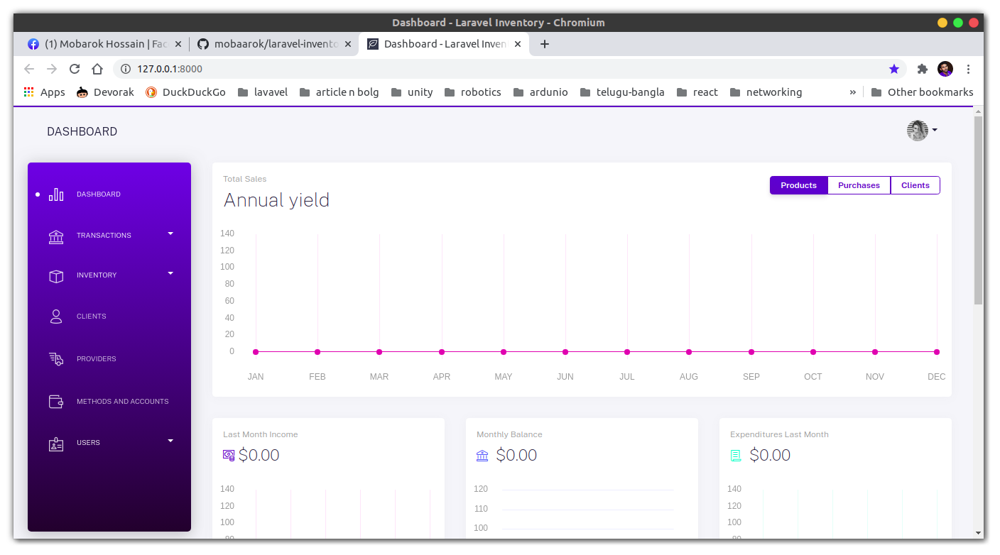
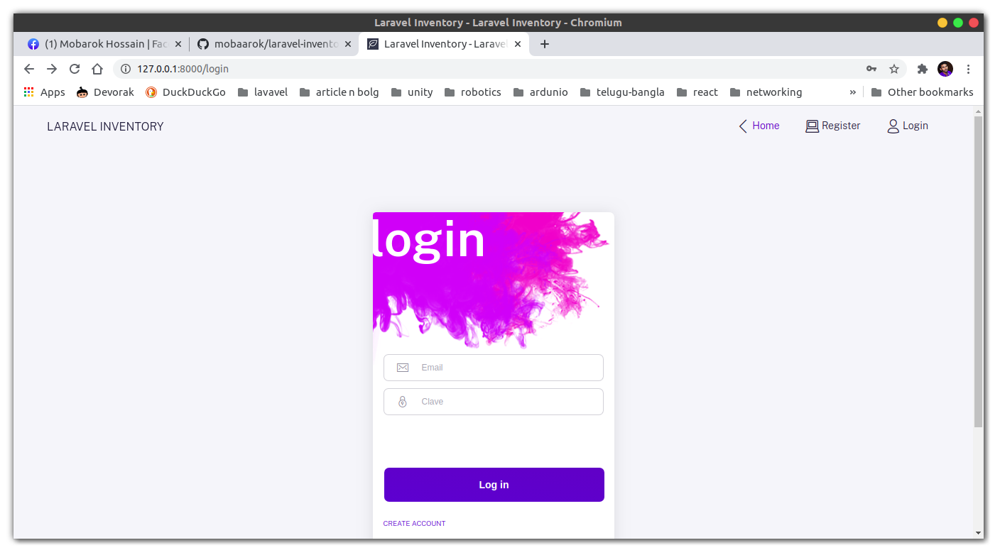
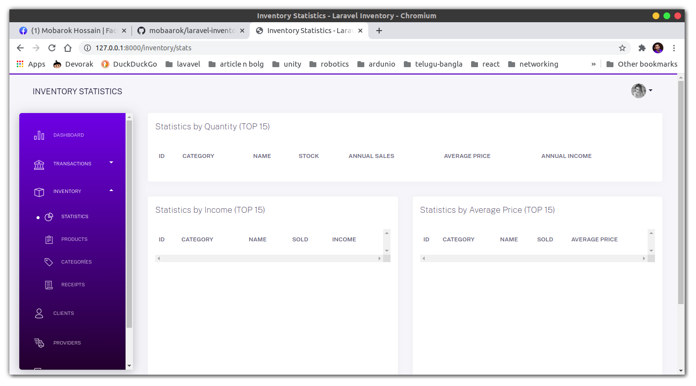

## Laravel Inventory Management
this project made by laraver 7

### to run this project in local pc
~~~ bash
git clone https://github.com/sanz/laravel-inventory.git
cd laravel-inventory
composer install
cp .env.example .env
php artisan migrate
php artisan key:generate
php artisan storage:link
php artisan serve
~~~

